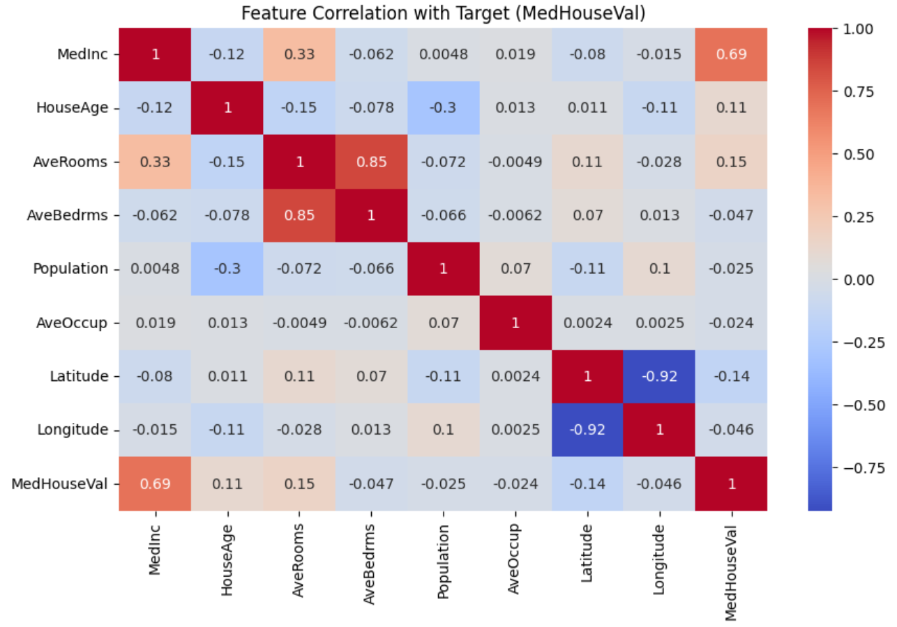
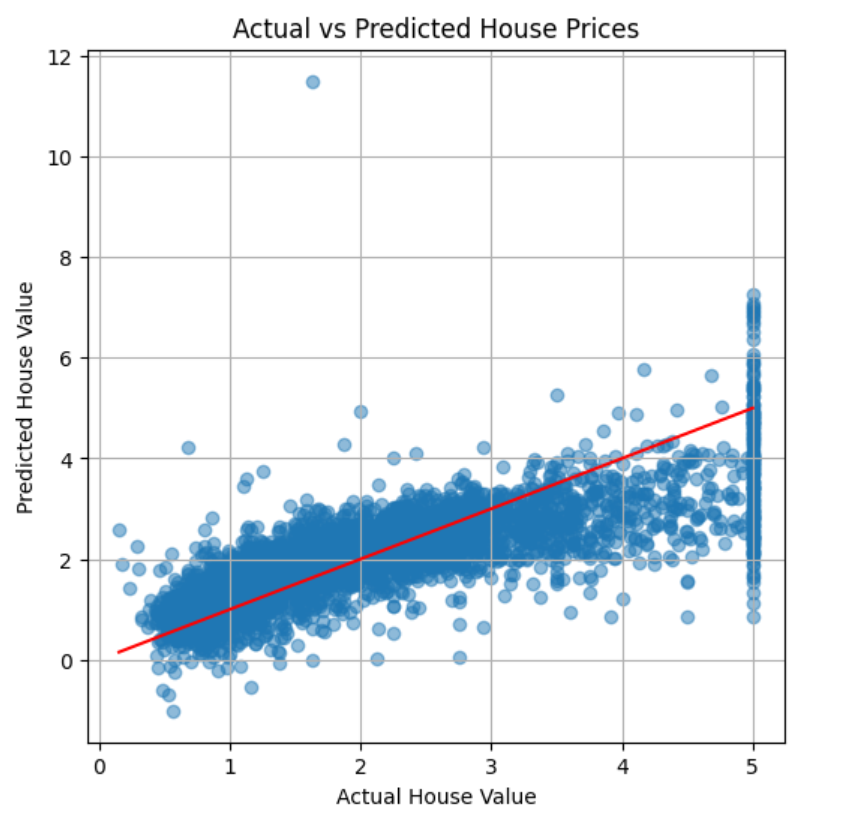

# 🏠 Housing Price Prediction (Linear Regression)

In this project focuses on using a supervised learning algorithm (Linear Regression) to predict **median house prices** based on real estate data from California.

## 📌 Objective

- Understand the basics of regression using supervised machine learning.
- Use Python and Scikit-learn to build and evaluate a predictive model.
- Visualize and interpret model results with appropriate metrics.

## 📁 Dataset

- Dataset Source: `sklearn.datasets.fetch_california_housing()`
- Features include: median income, house age, number of rooms, etc.
- Target: Median House Value (`MedHouseVal`)

## 🛠️ Tools & Libraries Used

- Python
- Jupyter Notebook
- pandas, numpy, matplotlib, seaborn
- scikit-learn

## 📈 Workflow

1. **Data Loading**  
   - Used `fetch_california_housing()` from `sklearn.datasets`.

2. **Data Exploration & Visualization**  
   - Heatmaps, histograms, and scatter plots to understand data distribution.

3. **Data Preprocessing**  
   - Split into training and testing sets using `train_test_split`.

4. **Model Building**  
   - Applied `LinearRegression()` from scikit-learn.

5. **Evaluation Metrics**  
   - Mean Squared Error (MSE): `0.56`
   - R² Score: `0.58`

6. **Prediction Visualization**  
   - Scatter plot comparing actual vs predicted values.

## 📊 Visualizations

| Heatmap | Predicted vs Actual |
|--------|---------------------|
|  |  |

## ✅ Conclusion

This project helped me understand the fundamentals of regression modeling. I learned how to:
- Build and train a linear regression model in Python
- Evaluate model performance using MSE and R²
- Visualize predictions and identify patterns in real-world data

## 🧠 Learnings

> “From this project I learned the difference between classification and regression tasks. I applied Linear Regression to predict housing prices using the California dataset and explored model evaluation using MSE and R² Score. This gave me a foundational understanding of ML model development.”

---

## 🔗 Connect With Me

🔗 GitHub: https://github.com/M-Z-5474

📧 Email: m.zainmushtaq74@gmail.com

🔗 LinkedIn: https://www.linkedin.com/in/muhammad-zain-m-a75163358/
________________________________________
🌟 If you like this project, please consider giving it a ⭐ on GitHub!

